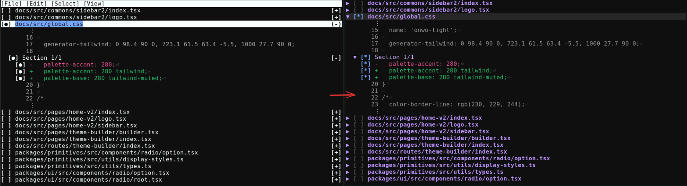

# Tug: SCM diff-editor

An opinionated redesign of scm-record for clearer visibility.



## Installation via flakes

```nix
inputs.tug-record = {
  url = "github:emilien-jegou/scm-record";
  inputs.nixpkgs.follows = "nixpkgs"; # optional
};

# ...

environment.systemPackages = with pkgs; [
  inputs.tug-record.packages.${pkgs.system}.default
]
```

## Configuration for jujutsu

```config.toml
[ui]
diff-editor = "tug-diff-editor"
diff-instructions = false

[merge-tools.tug-diff-editor]
edit-args = ["-d", "$left", "$right"]
```

## More info

https://github.com/arxanas/scm-record/blob/main/README.md
